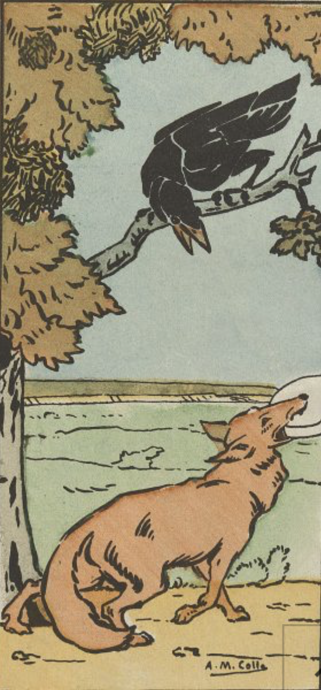

# Le corbeau et le renard
le **corbeau** ayant chanté tout l'été se trouva fort depourvu lorsque la bise fut venu pas un seul petit morceau de :
- mcdo
- mouche 
- vermiseau

il alla crier famine aupres de *renard* sa copine.
;

Mais *renard* sa copine, etait shahtt egalement, et ce fut complique pour lui de dépanner shrab **corbeau**, tu connais les bails.  
Mais *renard* avait un plan, et il comptait bien faire participer **corbeau**, meme si c'est intention n'était pas aussi nobles que ce qu'il parraissait.   
En effet, *renard* était devenu gérant du terrain, et grace aux ailes de **corbeaux** il parvint a écouler tout son stoc sans jamais faire de perte.  
Malheureusement au moment de ralass, *renard* ghosta **corbeaux** et fuit dans les montagnes.  

### Des années plus tard
Corbeau n'avait pas **oublié** renard, il le traquait sans relâche depuis des *semaines*.
Il était en manque, il tremblait, il voulait **tuer renard** d'avoir été un faux frère. 

Il finit par arriver près d'une petite ferme où il y avait des poules. Le **corbeau** eu donc une idée. Sachant que le *renard* aime manger les poules, il allait se cacher pour lui faire une [embuscade](https://www.larousse.fr/dictionnaires/francais/embuscade/28702).

Corbeau se percha en haut d'un grand chêne près de la ferme, surveillant attentivement les allées et venues de Renard. Il savait que l'appât parfait était à portée de bec, et il attendait patiemment le moment propice pour lancer son attaque sournoise. 

<<<<<<< HEAD
## Liste des branches
+ Main
+Development
+Marine
+Gwen

Mille excuse hamed, je ne pourrai pas ajouter une suite logique a ta belle hisoire.
=======
Le **corbeau** avait fait un stock et cailloux et comptait bien défoncer cet enfoiré de **renard**. Pour etre sur de faire payer le **renard** il avait aussi piéger l'enclos des poules. Vivement que **Renard** arrive Mouhahahaha

>>>>>>> 82975a4a2855da1f39ae6ce266251282044e8011

